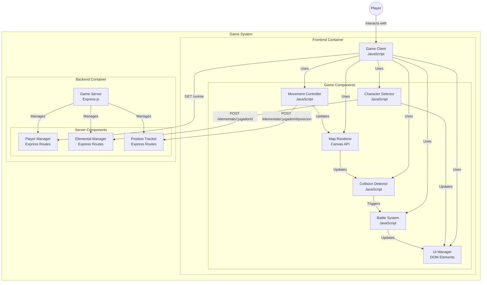

DIAGRAM-ELEMENTALS

```mermaid
graph TB
    User((Player))
    
    subgraph "Game System"
        subgraph "Frontend Container"
            ClientApp["Game Client<br>JavaScript"]
            
            subgraph "Game Components"
                GameUI["UI Manager<br>DOM Elements"]
                CharacterSelector["Character Selector<br>JavaScript"]
                BattleSystem["Battle System<br>JavaScript"]
                MapRenderer["Map Renderer<br>Canvas API"]
                MovementController["Movement Controller<br>JavaScript"]
                CollisionDetector["Collision Detector<br>JavaScript"]
            end
        end
        
        subgraph "Backend Container"
            GameServer["Game Server<br>Express.js"]
            
            subgraph "Server Components"
                PlayerManager["Player Manager<br>Express Routes"]
                ElementalManager["Elemental Manager<br>Express Routes"]
                PositionTracker["Position Tracker<br>Express Routes"]
            end
        end
    end

    %% Frontend Component Relationships
    ClientApp -->|Uses| GameUI
    ClientApp -->|Uses| CharacterSelector
    ClientApp -->|Uses| BattleSystem
    ClientApp -->|Uses| MapRenderer
    ClientApp -->|Uses| MovementController
    ClientApp -->|Uses| CollisionDetector
    
    %% Frontend-Backend Communication
    CharacterSelector -->|"POST /elementals/:jugadorId"| ElementalManager
    MovementController -->|"POST /elementals/:jugadorId/posicion"| PositionTracker
    ClientApp -->|"GET /unirse"| PlayerManager
    
    %% Component Interactions
    MapRenderer -->|Updates| CollisionDetector
    MovementController -->|Updates| MapRenderer
    CollisionDetector -->|Triggers| BattleSystem
    CharacterSelector -->|Updates| GameUI
    BattleSystem -->|Updates| GameUI
    
    %% User Interaction
    User -->|Interacts with| ClientApp
    
    %% Server Component Relationships
    GameServer -->|Manages| PlayerManager
    GameServer -->|Manages| ElementalManager
    GameServer -->|Manages| PositionTracker
```
